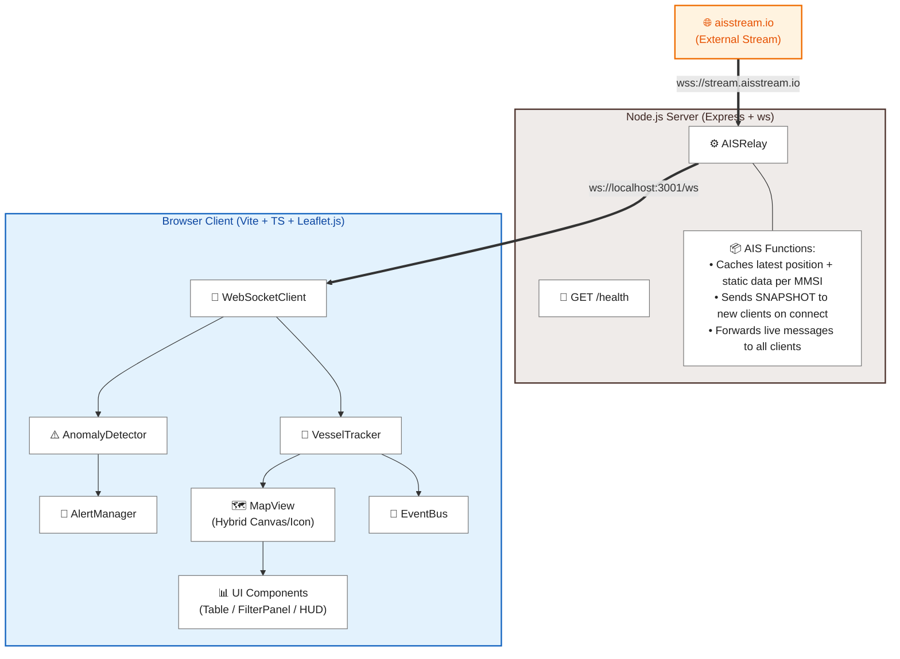
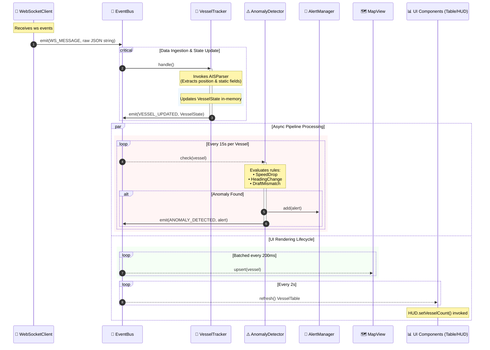

# AIS Maritime Dashboard

A real-time global vessel tracking dashboard powered by live AIS (Automatic Identification System) data. Ships broadcast their position, speed, heading, and identity via AIS transponders; this application receives those broadcasts and visualises them on an interactive map with anomaly detection, filtering, and vessel intelligence.

---
Live Link: https://lokeshbud.github.io/AIS_viwer/
---

## What It Does

- Displays **live positions of 10,000+ vessels** worldwide, updated in real time
- Shows ship-shaped SVG icons per vessel category at high zoom, canvas circles at low zoom
- Draws **maritime route lines** from a vessel's current position to its declared destination port
- Displays **position history trails** (last 300 snapshots) when a vessel is selected
- Runs an **anomaly detection engine** that flags suspicious behaviour: sudden speed drops, sharp heading changes, and draught mismatches
- Provides **vessel filtering** by category, navigational status, and speed
- Supports **full-text search** by vessel name or MMSI
- Shows a **sortable vessel table** with an inline anomaly column
- Colorcodes vessels by destination continent

---

## Architecture



### Server (`server/`)

The server is a thin relay — it does not process or interpret AIS messages. Its only job is to:

1. Maintain a persistent WebSocket connection to [aisstream.io](https://aisstream.io), authenticated with an API key
2. Keep an in-memory cache of the latest `PositionReport` and `ShipStaticData` per MMSI (up to 8,000 vessels each, with LRU eviction)
3. When a browser client connects, send a `SNAPSHOT` message containing all cached positions and static data so the map populates instantly without waiting for live updates
4. Relay every live AIS message to all connected browser clients in real time
5. Reconnect to aisstream.io automatically on disconnect with exponential backoff (1s → 16s)

**Key files:**

- `server/index.ts` — Express HTTP server, WebSocketServer, health endpoint at `GET /health`
- `server/AISRelay.ts` — upstream connection management, caching, snapshot delivery, broadcast

### Client (`src/`)

The client is a single-page application bundled by Vite. It receives raw AIS JSON from the relay WebSocket and handles all parsing, state management, rendering, and intelligence locally in the browser.

**Data pipeline:**



**Key directories:**

| Path          | Purpose                                                             |
| ------------- | ------------------------------------------------------------------- |
| `src/ais/`    | AIS message parsing, VesselTracker state machine, WebSocket client  |
| `src/agent/`  | AnomalyDetector, AlertManager, anomaly rules                        |
| `src/ui/`     | MapView, HUD, VesselTable, FilterPanel, VesselInfoPanel, VesselIcon |
| `src/utils/`  | EventBus, RingBuffer, ports database, maritime routing, constants   |
| `src/styles/` | CSS (dark HUD theme, panel layouts, icon states)                    |
| `server/`     | Node.js relay server                                                |

---

## Setup

### Prerequisites

- Node.js 18+
- An API key from [aisstream.io](https://aisstream.io) (free tier available)

### Install

```bash
npm install
```

### Configure

Create a `.env` file in the project root:

```
AIS_API=your_aisstream_api_key_here
PORT=3001
```

### Run (development)

```bash
npm run dev
```

This starts both the relay server (`localhost:3001`) and the Vite dev client (`localhost:5173`) concurrently.

### Build & run (production)

```bash
npm run build
npm start
```

Vite output lands in `dist/client/`; the server serves it as static files.

### Health check

```bash
curl http://localhost:3001/health
```

Returns connected client count, tracked vessel count, and live message rate.

---

## Live Data Handling

### Message types

AIS messages from aisstream.io arrive as JSON. The application handles two types:

- **`PositionReport` / `StandardClassBPositionReport`** — latitude, longitude, SOG (speed over ground), COG (course over ground), true heading, rate of turn, navigational status. These arrive continuously and drive marker movement on the map.
- **`ShipStaticData`** — vessel name, call sign, ship type (ITU code → category), draught, declared destination. These arrive much less frequently (every few minutes per vessel) and are merged into the existing vessel state when received.

### Vessel lifecycle

1. First `PositionReport` for an MMSI creates a `VesselState` entry with default fields
2. Subsequent position reports update position, speed, heading, and push a `PositionSnapshot` into a ring buffer (max 300 entries)
3. `ShipStaticData` enriches the same record with name, type, destination
4. Vessels not updated for 10 minutes are purged from state and removed from the map
5. On reconnect, the server's SNAPSHOT re-populates the map immediately

### Batched rendering

`MapView` does not re-render on every incoming message. Position updates accumulate in a `pending` map and are flushed to the map at 200ms intervals, preventing layout thrashing when thousands of vessels update simultaneously.

### Hybrid canvas / divIcon rendering

At zoom level < 8, all vessels render as `L.CircleMarker` on a single shared HTML5 `<canvas>` element — zero DOM nodes per vessel. At zoom ≥ 8, in-viewport vessels switch to `L.Marker` with inline SVG ship icons (per vessel category), rotated by COG. Out-of-viewport markers are removed on pan. This keeps DOM node count under ~200 at any zoom level regardless of total vessel count.

---

## Anomaly Detection

The `AnomalyDetector` checks each vessel at most once every 15 seconds. It runs three independent rules. Alerts are deduplicated within 5-minute windows per vessel per alert type. The latest alert per vessel appears as a badge in the vessel table.

### Rule 1 — Speed Drop (`SPEED_DROP`)

**Trigger:** A vessel that was moving (peak SOG ≥ 2 kn in the last 3 minutes) drops to a speed that is more than 35% below its recent peak.

**Severity:**

- `critical` — vessel comes to a complete stop while not anchored or moored
- `warning` — significant speed reduction without a full stop

**Intent:** Detect unexpected engine failure, sudden grounding, or deliberate dark-vessel stops.

**Constants:** `SPEED_DROP_THRESHOLD = 0.35`, `ANOMALY_WINDOW_SECS = 180`

---

### Rule 2 — Sharp Heading Change (`SHARP_HEADING`)

**Trigger:** A vessel underway at ≥ 3 kn changes its course by more than 35° total within a 3-minute sliding window, and at least 40% of consecutive position pairs within that window also show meaningful heading change (>5°). The 40% consistency check filters out single GPS glitches that bounce COG between two frames.

**Severity:**

- `critical` — heading change occurs at speed > 15 kn (high-energy turn)
- `warning` — turn at lower speed

**Intent:** Detect evasion manoeuvres, unexpected course deviations, or vessels behaving inconsistently with their declared route.

**Constants:** `HEADING_CHANGE_THRESHOLD = 35`, `ANOMALY_WINDOW_SECS = 180`

---

### Rule 3 — Draught Mismatch (`DRAFT_MISMATCH`)

**Trigger:** A vessel's declared draught falls outside the expected range for its category. Requires at least 20 position history points before firing (prevents false positives from freshly-seen vessels with stale or unconfigured transponder data).

**Expected draught ranges (in metres):**

| Category  | Min   | Max    |
| --------- | ----- | ------ |
| Cargo     | 2.5 m | 16.0 m |
| Tanker    | 4.0 m | 21.0 m |
| Passenger | 2.5 m | 9.5 m  |
| Fishing   | 0.8 m | 4.5 m  |
| Tugboat   | 1.5 m | 5.5 m  |
| Military  | 2.0 m | 9.0 m  |

**Intent:** Flag vessels broadcasting an implausibly large or small draught for their type. A cargo ship reporting 0.5m draught is either empty (suspicious for a heavily loaded route) or has incorrect transponder configuration. Overloaded vessels may report draught beyond category norms.

---

## Use Cases

### Port authority situational awareness

Track all vessels approaching or departing a port region. Filter by navigational status to isolate vessels at anchor vs underway. Speed-drop alerts near fairways may indicate vessels waiting for a berth or in distress.

### Maritime security monitoring

Heading change alerts at high speed can indicate evasion behaviour. Draught mismatches on a tanker may flag undisclosed cargo. The MMSI search lets analysts pull up a specific vessel instantly.

### Fleet operations

Search for a vessel by name or MMSI, select it to see its current position, speed, destination, and recent track history. The route arc shows the great-circle maritime path to the declared destination.

### Research and education

Visual exploration of global shipping patterns — which routes are busiest, which vessel types dominate specific trade lanes, how SOG varies by category.

---

## Future Work

### Short term (actively working on)

| Feature / Objective   | Layer             | Technical Scope / Approach                                                                                                                                                     |                            Status                             |
| :-------------------- | :---------------- | :----------------------------------------------------------------------------------------------------------------------------------------------------------------------------- | :-----------------------------------------------------------: |
| **Geofence Alerts**   | Backend / Engine  | Implement efficient point-in-polygon checks (e.g., ray-casting or spatial indexing) against pre-defined polygon zones (`PolygonAlert`) on incoming position updates.           |                          🟢 Complete                          |
| **AIS Gap Detection** | Backend / State   | Monitor absolute global timestamps per`MMSI`. Trigger a dark-vessel anomaly state if a transmission drop exceeds $N$ minutes while last known coordinates indicate open ocean. | 🟠 added gap dectection but this feature will need monitoring |
| **Vessel Clustering** | Frontend / Canvas | Replace dense overlapping canvas markers at low zoom levels with dynamic, count-labeled cluster rings to optimize client-side render loops and HUD clarity.                    |                          🟢 Complete                          |

### Medium term
| Feature / Objective | Layer | Technical Scope / Approach | Status |
| :--- | :--- | :--- | :---: |
| **Historical Playback** | Backend / Database | Store position snapshots in a time-series database (e.g., InfluxDB or TimescaleDB) and implement a timeline scrubber to replay vessel movements. | ⚪ Planned |
| **Port Dwell Time Analysis** | Backend / State | Detect vessel entry into port bounding boxes and track duration; flag long dwell times for tankers or cargo ships indicating potential delays. | ⚪ Planned |
| **Proximity Alerts** | Backend / Engine | Compute pairwise distances between vessels underway in the same region; alert on proximity thresholds at speed to flag collision risks. | ⚪ Planned |
| **Destination Confidence** | Engine / Analytics | Cross-reference declared destinations against current heading and standard maritime routes; flag large divergences as potential false declarations. | ⚪ Planned |
| **Multi-Feed Aggregation** | Backend / Ingestion | Integrate additional AIS feeds (terrestrial receivers or satellite providers) alongside aisstream.io to fill coverage gaps and increase frequency. | ⚪ Planned |

### Long term

| Feature / Objective | Layer | Technical Scope / Approach | Status |
| :--- | :--- | :--- | :---: |
| **ML Anomaly Detection** | Engine / AI | Replace threshold-based rules with learned, per-vessel or per-category baselines (e.g., speed variations) to minimize false positives. | ⚪ Planned |
| **Cargo Intelligence Overlay**| Backend / Integration| Fuse AIS data with cargo manifests, port call records, and registry APIs (e.g., Lloyd's, MarineTraffic) to flag sanctions exposure or ownership anomalies. | ⚪ Planned |
| **Backend Persistence Layer** | Infrastructure | Migrate in-memory state to a Redis or PostgreSQL database to enable stateless server restarts and support horizontal scaling. | ⚪ Planned |
| **Mobile-Responsive Layout** | Frontend / UI | Redesign the desktop-heavy HUD into a responsive interface optimized for tablets and mobile devices used in on-the-water scenarios. | ⚪ Planned |
